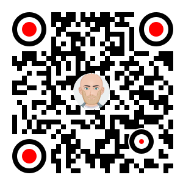
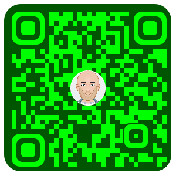

:toc:

Thank you so much @lome for providing this awesome library: https://github.com/lome/niceqr

I adopted the code, but ported it to Kotlin and tried to condense the code to what's really necessary.
I also added a few more options to the QR code generation... 👨‍💻️

== Creating QR Codes with Kotlin or Java

The entry point is the `QrCodeFactory`,
which will give you an instance of the `QrCodeApi` to create a QR code as `BufferedImage`.
This `BufferedImage` can be configured by passing an instance of `QrCodeConfig` and use for further image processing.

Examples for Java or Kotlin can be found in the `java-sample` or `kotlin-sample` module.

== Logo scaling

Scaling down the logo image in advance will improve the image quality of the logo.

But compare yourself:

Logo with 500x500px (Qr Code size=300px):

image::./docs/qr-with-logo.png[]

Logo with 60x60px (Qr Code size=300px):

image::./docs/qr-with-logo-scaled.png[]

NOTE: I chose 60x60px, because the default logo relative size is 0.2, which means 20% of the QR code size, which is 60x60px when having a 300x300px qr code (300*0.2=60).

The reason for this is the fact that the scaling capabilities of awt are *not* that good.

So you should either scale the logo manually or use the following beforehand:

- java.awt.Image.getScaledInstance(int width, int height, int hints)
- https://github.com/rkalla/imgscalr
- https://github.com/downgoon/marvin
- https://github.com/coobird/thumbnailator

== Example QR codes

Using the defaults only:

image::./docs/qr-with-defaults.png[]

Adding a center logo:

image::./docs/qr-with-logo-scaled.png[]

Having circles as positional "squares":

Make it "colorful":

Please be cautious when changing the colors!
*Not* having enough contrast may cause that qr code scanners are not capable to read the qr code!
