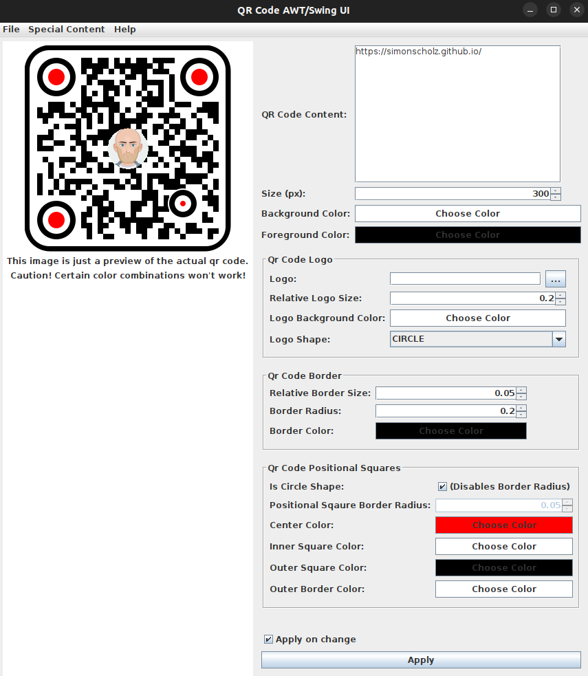
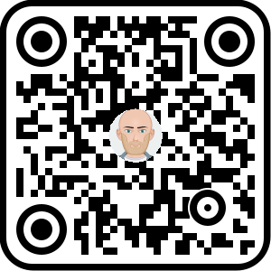
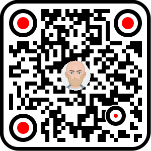
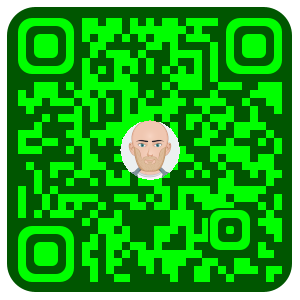
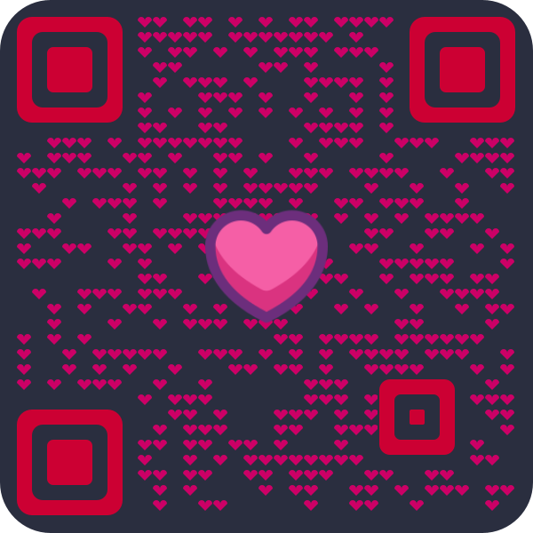
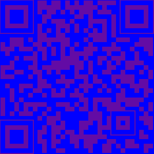
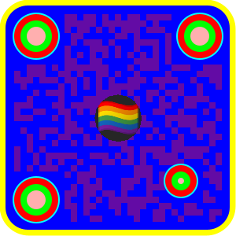

:toc:

This library uses the zxing library, which provides a simple API to create QR codes.

== Creating QR Codes with Kotlin or Java

The entry point for this library is the `QrCodeFactory`,
which will give you an instance of the `QrCodeApi` to create a QR code as `BufferedImage`.
This `BufferedImage` can be configured by passing an instance of `QrCodeConfig` and use for further image processing.

Examples for Java or Kotlin can be found in the https://github.com/SimonScholz/qr-code-with-logo/blob/main/java-sample/src/main/java/io/github/simonscholz/Main.java[`java-sample`] or https://github.com/SimonScholz/qr-code-with-logo/blob/main/kotlin-sample/src/main/kotlin/io/github/simonscholz/Main.kt[`kotlin-sample`] module.

The qr-code-app project makes it even easier to create QR codes with this library.



Just run the `qr-code-app` project and create your QR code with a nice UI.

[source, bash]
----
./gradlew :qr-code-app:run
----

https://www.jbang.dev/documentation/jbang-idea/latest/installation.html[jbang] can also be used to run the application:

[source, bash]
----
jbang catalog add --name simonscholz https://github.com/SimonScholz/jbang-catalog/blob/main/jbang-catalog.json

jbang trust add https://github.com/SimonScholz/qr-code-with-logo/releases/download/

jbang qr-code-app@simonscholz
----

Or download the appropriate distribution from the https://github.com/SimonScholz/qr-code-with-logo/releases[releases section].

More details about the application can be found https://github.com/SimonScholz/qr-code-with-logo#qr-code-app[here]

The app you can also generate the code for you, so you can just copy and paste it into your project.

== Quickstart

=== Gradle

Getting a released version:

[source, kotlin]
----
dependencies {
    implementation("io.github.simonscholz:qr-code-with-logo:0.4.0")
    // Optional if you´d want to create QR code SVG images
    implementation("io.github.simonscholz:qr-code-with-logo-svg:0.4.0")
}
----

Using the snapshot version:

[source, kotlin]
----
repositories {
    mavenCentral()
    maven(
        url = "https://s01.oss.sonatype.org/content/repositories/snapshots/"
    )
}

dependencies {
    implementation("io.github.simonscholz:qr-code-with-logo:0.4.0-SNAPSHOT")
    // Optional if you´d want to create QR code SVG images
    implementation("io.github.simonscholz:qr-code-with-logo-svg:0.4.0-SNAPSHOT")
}
----

=== Maven

[source, xml]
----
<dependency>
    <groupId>io.github.simonscholz</groupId>
    <artifactId>qr-code-with-logo</artifactId>
    <version>0.4.0</version>
</dependency>

<!-- Optional if you´d want to create QR code SVG images -->
<dependency>
    <groupId>io.github.simonscholz</groupId>
    <artifactId>qr-code-with-logo-svg</artifactId>
    <version>0.4.0</version>
</dependency>
----

== kotlin

[source, kotlin]
----
import io.github.simonscholz.qrcode.QrCodeFactory.createQrCodeApi
import io.github.simonscholz.qrcode.DEFAULT_IMG_SIZE
import io.github.simonscholz.qrcode.QrCodeConfig
import java.awt.image.BufferedImage
import java.io.File
import javax.imageio.ImageIO

// extension function to write a BufferedImage to a file
fun BufferedImage.toFile(file: File) {
    ImageIO.write(this, "png", file)
}

val qrCodeApi = createQrCodeApi()
qrCodeApi.createQrImage(QrCodeConfig("https://simonscholz.dev/", DEFAULT_IMG_SIZE))
    .toFile(File("qr-with-defaults.png"))
----

For more advanced examples, please have a look at the https://github.com/SimonScholz/qr-code-with-logo/blob/main/kotlin-sample/src/main/kotlin/io/github/simonscholz/Main.kt[`kotlin-sample` module].

== java

[source, java]
----
import io.github.simonscholz.qrcode.QrCodeApi;
import io.github.simonscholz.qrcode.QrCodeConfig;
import io.github.simonscholz.qrcode.QrCodeFactory;
import javax.imageio.ImageIO;
import java.io.File;

import static io.github.simonscholz.qrcode.QrCodeConfigKt.DEFAULT_IMG_SIZE;

final QrCodeApi qrCodeApi = QrCodeFactory.createQrCodeApi();
final var qrCode = qrCodeApi.createQrImage(new QrCodeConfig("https://simonscholz.dev/", DEFAULT_IMG_SIZE));
ImageIO.write(qrCode, "png", new File("qr-with-defaults-java.png"));
----

For more advanced examples, please have a look at the https://github.com/SimonScholz/qr-code-with-logo/blob/main/java-sample/src/main/java/io/github/simonscholz/Main.java[`java-sample` module].

== SVG QR codes

This project has a new module called `qr-code-svg`, which will be available beginning with version 0.4.0.

[source, kotlin]
----
dependencies {
    implementation("io.github.simonscholz:qr-code-with-logo-svg:0.4.0")
}
----

[source, xml]
----
<dependency>
    <groupId>io.github.simonscholz</groupId>
    <artifactId>qr-code-with-logo-svg</artifactId>
    <version>0.4.0</version>
</dependency>
----

Under the hood https://xmlgraphics.apache.org/batik/[Apache Batik] is being used to create SVG files.

The API is pretty similar to what you already know from the regular examples.
The only difference is the `QrSvgLogoConfig` class for configuring the logo,
because it adds the opportunity to make use of a SVG image as logo besides using an `java.awt.Image` or base64 encoded image.

=== SVG code examples

==== Java

[source, java]
----
import io.github.simonscholz.qrcode.QrCodeConfig;
import io.github.simonscholz.svg.QrCodeSvgFactory;
import org.w3c.dom.Document;

import javax.xml.transform.Transformer;
import javax.xml.transform.TransformerException;
import javax.xml.transform.TransformerFactory;
import javax.xml.transform.dom.DOMSource;
import javax.xml.transform.stream.StreamResult;
import java.io.File;

public class SVGSamples {
    public static void main(final String[] args) throws TransformerException {
        QrCodeConfig qrCodeConfig = new QrCodeConfig.Builder("https://simonscholz.dev/").build();
        Document qrCodeDocument = QrCodeSvgFactory.createQrCodeApi().createQrCodeSvg(qrCodeConfig);
        TransformerFactory transformerFactory = TransformerFactory.newInstance();
        Transformer transformer = transformerFactory.newTransformer();
        DOMSource source = new DOMSource(qrCodeDocument);
        StreamResult result = new StreamResult(new File("qr-code.svg"));
        transformer.transform(source, result);
    }
}
----

==== Kotlin

[source, kotlin]
----
import io.github.simonscholz.qrcode.QrCodeConfig
import io.github.simonscholz.svg.QrCodeSvgFactory
import org.w3c.dom.Document
import java.io.File
import javax.xml.transform.TransformerFactory
import javax.xml.transform.dom.DOMSource
import javax.xml.transform.stream.StreamResult

fun main() {
    val svgConfig = QrCodeConfig.Builder("https://simonscholz.dev/").build()
    val qrCodeSvg = QrCodeSvgFactory.createQrCodeApi().createQrCodeSvg(svgConfig)
    qrCodeSvg.toFile(File("svg-qr-code.svg"))
}

fun Document.toFile(fileToSave: File) {
    val transformerFactory = TransformerFactory.newInstance()
    val transformer = transformerFactory.newTransformer()
    val source = DOMSource(this)
    val result = StreamResult(fileToSave)
    transformer.transform(source, result)
}
----

=== Generate SVG code

The really neat thing here again is that you can simply launch the qr-code-app application
and generate respective Java or Kotlin code for SVG image creation.

=== Caveats with logos for the SVG QR code

As mentioned earlier for SVG images you can use a `org.w3c.dom.Document` besides an `java.awt.Image` or base64 encoded `String`.
But all options come with downsides. When using a `org.w3c.dom.Document` svg logo image the shape cannot be adjusted
and the logo SVG is pasted in the center as is.
Whereas the java.awt.Image` or base64 encoded `String` remain raster images, which won´t look good when scaling the SVG image,
which is one of the main benefits of using SVG images.

== Example QR codes

All the examples you can see here are implemented in the `java-sample` and `kotlin-sample` modules.

The `qr-code-app` project makes it even easier to create QR codes with this library,
because it offers a UI to create QR codes and also offers a UI for the QR code design.
It can even generate the code for you, so you can just copy and paste it into your project.

=== Shapes

Using the defaults only:


Adding a center logo:


Adding a border:


Adding radius to positional squares:


Having circles as positional "squares":



=== Colors

Add some decent red color:



Make it look like a Minecraft Creeper QR code:



Make the QR code transparent and draw it onto a background image:

image::./docs/transparent-color.png[]

To see what's possible with colors, have a look at the rainbow example in the bad examples below.

=== Custom dot shapes

The library comes with some predefined dot shapes, but you can also create your own dot shapes.

Predefined dot shapes of the library:

- `QrCodeDotShape.SQUARE`
- `QrCodeDotShape.ROUNDED_SQUARE`
- `QrCodeDotShape.CIRCLE`
- `QrCodeDotShape.HEXAGON`
- `QrCodeDotShape.TRIANGLE`
- `QrCodeDotShape.HEART`
- `QrCodeDotShape.HOUSE`
- `QrCodeDotShape.STAR`
- `QrCodeDotShape.DIAMOND`
- `QrCodeDotShape.CROSS`
- `QrCodeDotShape.SMILEY`
- `QrCodeDotShape.FLOWER`
- `QrCodeDotShape.FLOWER_2`
- `QrCodeDotShape.FLOWER_3`
- `QrCodeDotShape.EASTER_EGG`

The app and samples show how to use these predefined dot shapes or create your own dot shapes.




If you want to see more examples, just run the sample code or the app.

The following example shows how to use the predefined dot shapes:

[source, kotlin]
----
import io.github.simonscholz.qrcode.QrCodeConfig
import io.github.simonscholz.qrcode.QrCodeDotShape
import io.github.simonscholz.qrcode.QrCodeFactory
import java.awt.Color
import java.awt.Graphics2D
import java.io.File
import java.nio.file.Files
import java.nio.file.Paths
import javax.imageio.ImageIO

fun main() {
  val path = Paths.get(System.getProperty("user.home"), "qr-code-samples")
  Files.createDirectories(path)
  val qrCodeDir = path.toAbsolutePath().toString()
  val qrCodeApi = QrCodeFactory.createQrCodeApi()

  QrCodeConfig.Builder("https://simonscholz.dev/")
      .qrCodeDotStyler(QrCodeDotShape.STAR)
      .qrCodeSize(800)
      .build()
      .run {
          qrCodeApi.createQrCodeImage(this)
              .toFile(File(qrCodeDir, "/qr-with-STAR-dots-kotlin.png"))
      }
}
----

The following example shows how to create a custom dot shape:

[source, kotlin]
----
import io.github.simonscholz.qrcode.QrCodeConfig
import io.github.simonscholz.qrcode.QrCodeDotShape
import io.github.simonscholz.qrcode.QrCodeFactory
import java.awt.Color
import java.awt.Graphics2D
import java.io.File
import java.nio.file.Files
import java.nio.file.Paths
import javax.imageio.ImageIO

fun main() {
  val path = Paths.get(System.getProperty("user.home"), "qr-code-samples")
  Files.createDirectories(path)
  val qrCodeDir = path.toAbsolutePath().toString()
  val qrCodeApi = QrCodeFactory.createQrCodeApi()
  QrCodeConfig.Builder("https://simonscholz.dev/")
      .qrCodeDotStyler(::drawSmiley)
      .qrCodeSize(800)
      .build()
      .run {
          qrCodeApi.createQrCodeImage(this)
              .toFile(File(qrCodeDir, "/qr-with-SMILEY-dots-kotlin.png"))
      }

  private fun drawSmiley(x: Int, y: Int, dotSize: Int, graphics: Graphics2D) {
      drawDotImage(x, y, dotSize, graphics, "smiley_fill.png")
  }

  private fun drawDotImage(x: Int, y: Int, dotSize: Int, graphics: Graphics2D, image: String) {
      val resource = Main::class.java.getClassLoader().getResource(image)
      resource?.let {
          val imageDot = ImageIO.read(it)
          graphics.drawImage(imageDot, x, y, dotSize, dotSize, null)
      }
  }
}
----

Besides just drawing a logo with the `Graphics2D` object, you can also draw whatever you want.

For more advanced examples and Java usage, please have a look at the `kotlin-sample` or `java-sample` modules.

=== Types

In order to create certain types of QR codes, you can may want to use the following utils.

Please see https://github.com/SimonScholz/qr-code-with-logo/blob/main/kotlin-sample/src/main/kotlin/io/github/simonscholz/QrCodeTypesMain.kt[`kotlin-sample` module] or https://github.com/SimonScholz/qr-code-with-logo/blob/main/java-sample/src/main/java/io/github/simonscholz/QrCodeTypesMain.java[`java-sample` module] to use these types and run the samples.

==== Simple types

```java
String url = SimpleTypes.url("https://simonscholz.dev/");

String geolocation = SimpleTypes.geolocation(53.59659752940634, 10.006589989354053);

String email = SimpleTypes.email("simon@example.com", "Hello World", "This is a test email");

String phoneNumber = SimpleTypes.phoneNumber("+49 176 12345678");

String sms = SimpleTypes.sms("+49 176 12345678", "Hello, this is a test SMS");

String wifi = SimpleTypes.wifi("My-Wifi", "MyWifiPassword");
```

These String values can be used to create a QR code.

.See simple QR Code type images
[%collapsible]
====
Simple url:


Simple geolocation:


Simple email:


Simple phoneNumber:


Simple sms:

image::./docs/types/simple-sms.png[]

Simple wifi:


====

==== More complex types

VEVENT type:

```java
LocalDateTime startDateTime = LocalDateTime.now().plusWeeks(2);
VEvent vevent = new VEvent.Builder("QR Codes with Kotlin & Java")
                .location("Java User Group Hamburg")
                .startDate(startDateTime)
                .endDate(startDateTime.plusHours(2))
                .description("Let's create QR Codes with Kotlin & Java")
                .build();
String vEventQrCodeText = vevent.toVEventQrCodeText();
```

The `vEventQrCodeText` can then be used to create a QR code.

.See QR Code image
[%collapsible]
====

====

VCARD type:

```java
VCard vCard = new VCard.Builder("Simon Scholz")
                .email("simon@example.com")
                .address("Main Street 1", "Hamburg", "22855")
                .organization("Self Employed")
                .phoneNumber("+49 176 12345678")
                .website("https://simonscholz.dev/")
                .build();
String vCardQrCodeText = vCard.toVCardQrCodeText();
```

The `vCardQrCodeText` can then be used to create a QR code.

.See QR Code image
[%collapsible]
====

====

== Base64 encoded qr code image and logo

The logo image can be added as file or as Base64 encoded string.

The qr code image can also be returned as Base64 encoded string.

Also the the qr-code-app application, which can also deal with Base64 encoded strings for the logo and the qr code image.

== Logo scaling

Scaling down the logo image in advance will improve the image quality of the logo.

But compare yourself:

Logo with 500x500px (Qr Code size=300px):

image::./docs/qr-with-logo-unscaled.png[]

Logo with 60x60px (Qr Code size=300px):


NOTE: I chose 60x60px, because the default logo relative size is 0.2, which means 20% of the QR code size, which is 60x60px when having a 300x300px qr code (300*0.2=60).

The reason for this is the fact that the scaling capabilities of awt are *not* that good.

So you should either scale the logo manually or use the following beforehand:

- java.awt.Image.getScaledInstance(int width, int height, int hints)
- https://github.com/rkalla/imgscalr
- https://github.com/downgoon/marvin
- https://github.com/coobird/thumbnailator

== Bad examples

Not having enough contrast:



The rainbow QR code to depict what's possible:



These are bad examples, because the colors are not contrasting enough.

So please be cautious when changing the colors!
*Not* having enough contrast may cause that qr code scanners are not capable to read the qr code!
If you try to scan the bad exmaple qr codes from above, you will see that it's not working.

== Qr Code App

The `qr-code-app` project is a simple Swing application, which uses this library to create QR codes.

=== Features

- Create QR codes with a UI
- Offers a UI for simple QR codes (url, email, phone number, sms, geolocation)
- Offers a UI for more complex QR codes (vcard, vevent)
- Offers properties panel for the QR code design (colors, shapes, logo, etc.)
- Offers a preview panel to see the QR code design
- Logo can be added as file or base64 encoded string
- Save the QR code as image
- Copy the QR code to the clipboard
- Copy the QR code as Base64 encoded string to the clipboard
- Save/Export the QR code config/design to a file for later or sharing with others
- Load/Import a QR code from a config/design file
- Copy sample code based on current config to the clipboard (Java or Kotlin)

Feel free to ask for new features or create a pull request if you want to add more features.

=== Config of the UI

The latest config is stored in the operating systems app data directory (~/.config/qr-code-app or C:\AppData\qr-code-app) when closing the application.
On startup of the application this config is loaded and used to create a QR code.

=== Sharing the config

The config can be shared with others by saving it via `File > Export Config` or `CTRL+E` shortcut to a file and sending it to others.
Others can then load the config via `File > Import Config` or `CTRL+I` shortcut.
The good thing is that also the logo image is stored in the config file, so you don't have to send the logo image separately.
This is archived by converting the logo image to a Base64 encoded string.

=== Running the app

Either start it from your IDE or use Gradle to run it:

[source, bash]
----
./gradlew :qr-code-app:run
----

=== Downloading the app (without Java)

The https://github.com/SimonScholz/qr-code-with-logo/releases[releases section] offers distributions for different operating systems,
which consists of a `qr-code-app` and `qr-code-app.bat` file in the `/bin` folder, which can be executed directly.
(does **not** require Java to be installed on your system)

== Support for other image formats

You can make use of the following project to also create different image formats: https://github.com/haraldk/TwelveMonkeys
This works because image io is highly extensible via SPI implementations.

Therefore you can also pass an `imageFormatName` to the creation of a base64 image:

[source, kotlin]
----
val base64QrCodeImage = QrCodeFactory.createQrCodeApi()
    .createBase64QrCodeImage(
        qrCodeConfig = qrCodeConfig,
        imageFormatName = "png",
    )
println(base64QrCodeImage)
----

== Useful sources

- https://zxing.org/w/decode.jspx[Decoding qr codes using zxing]
- https://www.qrcode.com/en/about/version.html[QR Code Versions]
- https://android.googlesource.com/platform/frameworks/opt/vcard/+/ics-mr1/java/com/android/vcard/VCardConstants.java[Android VCardConstants]
- https://github.com/haraldk/TwelveMonkeys
- https://simonscholz.dev/tutorials/publish-maven-central-gradle[How I published this library to Maven Central]

== Acknowledgements

Thank you so much @lome for providing this awesome code at https://github.com/lome/niceqr,
where I gained a lot of ideas and adopted some parts of the code.

== License

This library is licensed under the Apache License, Version 2.0.

== Contributing

Thank you for considering contributing to this project! Whether it's reporting bugs, suggesting enhancements, or submitting code changes, your contributions are greatly appreciated.

To get started, please follow these guidelines:

. Fork the repository and clone it to your local machine.
. Create a new branch for your feature or bug fix.
. Run `./gradlew installKtlintGitPrePushHook` to ensure that ktlint does not have issues with your code.
. Make your changes and ensure they adhere to the project's coding standards and guidelines.
. Test your changes thoroughly.
. Commit your changes with clear and descriptive messages.
. Push your branch to your fork of the repository.
. Submit a pull request, clearly describing the changes you've made.

If you have any questions or need further assistance, feel free to open an issue or reach out to me.

Again, thank you for your contributions!
